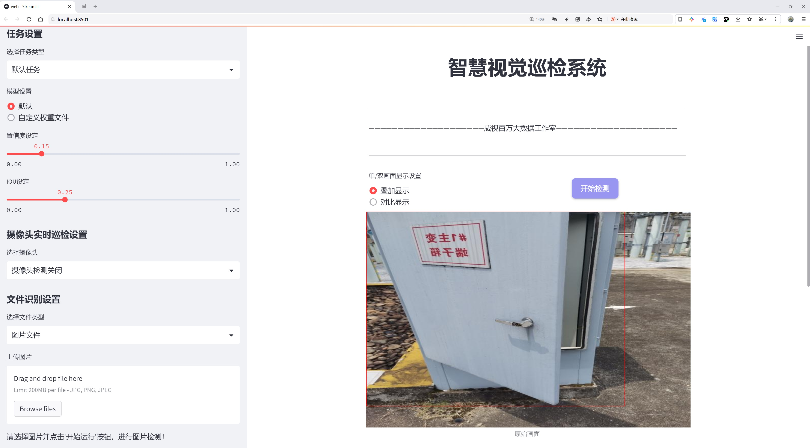
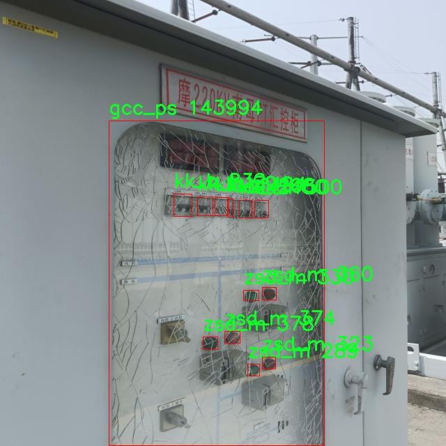

# 环境监测设备检测系统源码分享
 # [一条龙教学YOLOV8标注好的数据集一键训练_70+全套改进创新点发刊_Web前端展示]

### 1.研究背景与意义

项目参考[AAAI Association for the Advancement of Artificial Intelligence](https://gitee.com/qunmasj/projects)

研究背景与意义

随着全球经济的快速发展和城市化进程的加速，环境污染问题日益严重，已成为影响人类健康和可持续发展的重要因素。各类有害气体、颗粒物及其他污染物的排放，不仅对生态环境造成了不可逆转的损害，也对人类的生活质量和健康产生了深远的影响。因此，建立高效、精准的环境监测系统显得尤为重要。近年来，计算机视觉和深度学习技术的迅猛发展，为环境监测提供了新的解决方案，尤其是目标检测技术的进步，使得实时监测和识别环境中各种污染物成为可能。

YOLO（You Only Look Once）系列模型作为一种高效的目标检测算法，因其快速的检测速度和较高的准确率，广泛应用于各类视觉识别任务。YOLOv8作为该系列的最新版本，在算法架构和性能上都有了显著提升，尤其在小目标检测和复杂场景下的表现更为突出。通过对YOLOv8进行改进，可以进一步提高其在环境监测中的应用效果，使其能够更好地适应多样化的环境和复杂的检测任务。

本研究基于改进YOLOv8的环境监测设备检测系统，利用包含5167张图像和78个类别的数据集，旨在提升环境监测的智能化水平和实时性。该数据集涵盖了多种环境监测相关的类别，如气体泄漏、噪声污染、空气质量等，能够为模型的训练和评估提供丰富的样本。这些类别的多样性不仅反映了环境监测的复杂性，也为目标检测模型的泛化能力提出了更高的要求。因此，针对这些特定类别进行模型的改进和优化，将有助于提升检测的准确性和效率。

通过本研究的实施，期望能够实现以下几个目标：首先，构建一个高效的环境监测设备检测系统，能够实时识别和定位环境中的污染源；其次，利用改进的YOLOv8模型，提升对小目标和复杂背景下的检测能力，确保监测结果的准确性；最后，探索深度学习技术在环境监测中的应用潜力，为未来的智能环境监测系统提供理论基础和技术支持。

综上所述，本研究不仅具有重要的学术价值，还有助于推动环境监测技术的进步，提升社会对环境保护的重视程度。通过引入先进的深度学习技术，能够为环境治理提供更为科学和有效的手段，助力实现可持续发展的目标。因此，基于改进YOLOv8的环境监测设备检测系统的研究，不仅是对现有技术的延续和发展，更是对未来环境保护工作的重要贡献。

### 2.图片演示




##### 注意：由于此博客编辑较早，上面“2.图片演示”和“3.视频演示”展示的系统图片或者视频可能为老版本，新版本在老版本的基础上升级如下：（实际效果以升级的新版本为准）

  （1）适配了YOLOV8的“目标检测”模型和“实例分割”模型，通过加载相应的权重（.pt）文件即可自适应加载模型。

  （2）支持“图片识别”、“视频识别”、“摄像头实时识别”三种识别模式。

  （3）支持“图片识别”、“视频识别”、“摄像头实时识别”三种识别结果保存导出，解决手动导出（容易卡顿出现爆内存）存在的问题，识别完自动保存结果并导出到。

  （4）支持Web前端系统中的标题、背景图等自定义修改，后面提供修改教程。

  另外本项目提供训练的数据集和训练教程,暂不提供权重文件（best.pt）,需要您按照教程进行训练后实现图片演示和Web前端界面演示的效果。

### 3.视频演示

[3.1 视频演示](https://www.bilibili.com/video/BV1PoWUeYEds/?spm_id_from=333.999.0.0&vd_source=bc9aec86d164b67a7004b996143742dc)

### 4.数据集信息展示

数据集信息展示

本数据集名为“demo1”，专为改进YOLOv8的环境监测设备检测系统而设计，旨在为相关研究和应用提供丰富的训练数据。该数据集包含5167张图像，涵盖了78个不同的类别，充分展示了环境监测领域中多样化的对象和场景。这些图像的采集和标注经过精心设计，以确保数据的准确性和代表性，为模型的训练提供坚实的基础。

在这78个类别中，涵盖了多种环境监测设备和相关物体，例如“SF6ylb”、“aqmzc”、“bj_bpmh”等，反映了环境监测的复杂性和多样性。每个类别的选择都经过深思熟虑，旨在确保模型能够识别和区分不同类型的监测设备及其工作状态。这种多样性不仅提升了模型的泛化能力，也使其在实际应用中能够更好地适应不同的环境和任务需求。

数据集中的图像质量高，内容丰富，涵盖了各种环境条件下的监测设备，包括不同的光照、角度和背景。这种多样化的图像数据将有助于提高YOLOv8模型在实际应用中的鲁棒性，使其能够在不同的环境中准确识别和检测目标。此外，数据集的图像数量达到5167张，提供了足够的样本量，以支持深度学习模型的训练，确保模型能够学习到有效的特征表示。

在数据集的构建过程中，遵循了开放获取的原则，数据集的使用遵循CC BY 4.0许可证。这意味着研究人员和开发者可以自由使用、修改和分发该数据集，只需适当引用原始数据集的来源。这种开放性不仅促进了学术交流，也为环境监测领域的技术进步提供了良好的支持。

通过使用“demo1”数据集，研究人员可以有效地训练和优化YOLOv8模型，以实现更高效的环境监测设备检测。这将为环境保护、资源管理和公共安全等领域提供强有力的技术支持，推动智能监测技术的发展。随着环境监测需求的不断增加，基于深度学习的检测系统将发挥越来越重要的作用，而“demo1”数据集正是实现这一目标的重要工具。

总之，“demo1”数据集不仅为YOLOv8模型的训练提供了丰富的图像数据和多样的类别选择，也为环境监测技术的研究和应用开辟了新的方向。通过对该数据集的深入研究和应用，相关领域的研究人员和工程师将能够开发出更为精准和高效的环境监测解决方案，为可持续发展和生态保护贡献力量。





### 5.全套项目环境部署视频教程（零基础手把手教学）

[5.1 环境部署教程链接（零基础手把手教学）](https://www.ixigua.com/7404473917358506534?logTag=c807d0cbc21c0ef59de5)


[5.2 安装Python虚拟环境创建和依赖库安装视频教程链接（零基础手把手教学）](https://www.ixigua.com/7404474678003106304?logTag=1f1041108cd1f708b01a)

### 6.手把手YOLOV8训练视频教程（零基础小白有手就能学会）

[6.1 环境部署教程链接（零基础手把手教学）](https://www.ixigua.com/7404477157818401292?logTag=d31a2dfd1983c9668658)

### 7.70+种全套YOLOV8创新点代码加载调参视频教程（一键加载写好的改进模型的配置文件）

[7.1 环境部署教程链接（零基础手把手教学）](https://www.ixigua.com/7404478314661806627?logTag=29066f8288e3f4eea3a4)

### 8.70+种全套YOLOV8创新点原理讲解（非科班也可以轻松写刊发刊，V10版本正在科研待更新）

由于篇幅限制，每个创新点的具体原理讲解就不一一展开，具体见下列网址中的创新点对应子项目的技术原理博客网址【Blog】：


[8.1 70+种全套YOLOV8创新点原理讲解链接](https://gitee.com/qunmasj/good)

### 9.系统功能展示（检测对象为举例，实际内容以本项目数据集为准）

图1.系统支持检测结果表格显示

  图2.系统支持置信度和IOU阈值手动调节

  图3.系统支持自定义加载权重文件best.pt(需要你通过步骤5中训练获得)

  图4.系统支持摄像头实时识别

  图5.系统支持图片识别

  图6.系统支持视频识别

  图7.系统支持识别结果文件自动保存

  图8.系统支持Excel导出检测结果数据


### 10.原始YOLOV8算法原理

原始YOLOv8算法原理

YOLOv8（You Only Look Once version 8）是目标检测领域的一项重要进展，作为YOLO系列的最新模型，它在设计和实现上进行了诸多创新，旨在提升目标检测的精度和速度。与以往的YOLO版本相比，YOLOv8采用了anchor-free的方法，摆脱了传统的anchor-based检测框架，极大地简化了模型的结构，同时提高了检测的准确性和实时性。这一变革不仅为目标检测提供了新的思路，也为后续的研究和应用奠定了基础。

YOLOv8的网络结构主要由四个模块组成：输入端、主干网络、Neck端和输出端。输入端负责对输入图像进行预处理，包括Mosaic数据增强、自适应图片缩放和灰度填充等技术。这些预处理步骤旨在增强模型的鲁棒性，使其能够在多样化的环境中表现出色。主干网络则是特征提取的核心部分，采用了CSPDarknet结构，通过卷积和池化等操作提取图像特征。YOLOv8引入了C2f模块，替代了传统的C3模块，这一创新使得特征提取过程中的信息流动更加高效，能够更好地捕捉图像中的细节。

在Neck端，YOLOv8采用了路径聚合网络（PAN）结构，通过上采样和下采样的方式对不同尺度的特征图进行融合。这一过程不仅提高了特征的表达能力，还增强了模型对多尺度目标的检测能力。输出端则采用了decoupled head结构，实现了分类和回归过程的解耦，进一步提升了模型的性能。YOLOv8的Task-Aligned Assigner方法通过对分类分数和回归分数的加权匹配，优化了正样本的选择，从而提高了检测的准确性。

YOLOv8的创新之处还体现在其损失函数的设计上。与传统的CIoU损失函数相比，YOLOv8引入了MPDIoU损失函数，这一新损失函数不仅提高了模型的泛化能力，还增强了对小目标的检测性能。小目标检测一直是目标检测领域的难点，YOLOv8通过在Neck端引入GSConv和Slim-neck技术，保持了模型的精度同时降低了计算量，使得小目标的检测更加准确。

尽管YOLOv8在许多方面表现出色，但在复杂水面环境下的应用仍然面临挑战。小目标漂浮物的特征复杂且背景多样，导致YOLOv8在定位和感知能力上存在一定的不足。为了解决这些问题，研究者们提出了YOLOv8-WSSOD算法，通过引入BiFormer双层路由注意力机制，构建C2fBF模块，以减轻主干网络下采样过程中的噪声影响。这一改进不仅保留了特征提取过程中更细粒度的上下文信息，还增强了模型对复杂背景的适应能力。

总的来说，YOLOv8作为YOLO系列的最新版本，凭借其anchor-free的检测方式、创新的网络结构和高效的特征提取方法，在目标检测领域树立了新的标杆。其在精度和速度上的优越表现，使其成为计算机视觉任务中的重要工具，尤其是在实时目标检测和实例分割等应用场景中展现出强大的能力。随着YOLOv8的不断发展和改进，未来的目标检测技术将更加高效、准确，为各类应用提供更为强大的支持。


### 11.项目核心源码讲解（再也不用担心看不懂代码逻辑）

#### 11.1 ultralytics\nn\modules\transformer.py

以下是对代码中最核心部分的提取和详细中文注释：

```python
import torch
import torch.nn as nn
import torch.nn.functional as F

class TransformerEncoderLayer(nn.Module):
    """定义单个Transformer编码器层。"""

    def __init__(self, c1, cm=2048, num_heads=8, dropout=0.0, act=nn.GELU(), normalize_before=False):
        """初始化TransformerEncoderLayer，指定参数。"""
        super().__init__()
        self.ma = nn.MultiheadAttention(c1, num_heads, dropout=dropout, batch_first=True)  # 多头自注意力机制
        self.fc1 = nn.Linear(c1, cm)  # 前馈网络的第一层
        self.fc2 = nn.Linear(cm, c1)  # 前馈网络的第二层
        self.norm1 = nn.LayerNorm(c1)  # 第一层归一化
        self.norm2 = nn.LayerNorm(c1)  # 第二层归一化
        self.dropout = nn.Dropout(dropout)  # dropout层
        self.dropout1 = nn.Dropout(dropout)  # dropout层1
        self.dropout2 = nn.Dropout(dropout)  # dropout层2
        self.act = act  # 激活函数
        self.normalize_before = normalize_before  # 是否在前向传播前进行归一化

    def forward(self, src, src_mask=None, src_key_padding_mask=None, pos=None):
        """通过编码器模块前向传播输入。"""
        if self.normalize_before:
            return self.forward_pre(src, src_mask, src_key_padding_mask, pos)
        return self.forward_post(src, src_mask, src_key_padding_mask, pos)

    def forward_post(self, src, src_mask=None, src_key_padding_mask=None, pos=None):
        """后归一化的前向传播。"""
        q = k = self.with_pos_embed(src, pos)  # 计算查询和键
        src2 = self.ma(q, k, value=src, attn_mask=src_mask, key_padding_mask=src_key_padding_mask)[0]  # 自注意力
        src = src + self.dropout1(src2)  # 残差连接
        src = self.norm1(src)  # 归一化
        src2 = self.fc2(self.dropout(self.act(self.fc1(src))))  # 前馈网络
        src = src + self.dropout2(src2)  # 残差连接
        return self.norm2(src)  # 返回最终的归一化结果

    @staticmethod
    def with_pos_embed(tensor, pos=None):
        """如果提供了位置嵌入，则将其添加到张量中。"""
        return tensor if pos is None else tensor + pos


class AIFI(TransformerEncoderLayer):
    """定义AIFI Transformer层。"""

    def forward(self, x):
        """AIFI Transformer层的前向传播。"""
        c, h, w = x.shape[1:]  # 获取输入的通道、高度和宽度
        pos_embed = self.build_2d_sincos_position_embedding(w, h, c)  # 构建2D位置嵌入
        x = super().forward(x.flatten(2).permute(0, 2, 1), pos=pos_embed.to(device=x.device, dtype=x.dtype))  # 调用父类的前向传播
        return x.permute(0, 2, 1).view([-1, c, h, w]).contiguous()  # 恢复原始形状

    @staticmethod
    def build_2d_sincos_position_embedding(w, h, embed_dim=256, temperature=10000.0):
        """构建2D正弦余弦位置嵌入。"""
        grid_w = torch.arange(int(w), dtype=torch.float32)
        grid_h = torch.arange(int(h), dtype=torch.float32)
        grid_w, grid_h = torch.meshgrid(grid_w, grid_h, indexing="ij")  # 创建网格
        pos_dim = embed_dim // 4  # 位置维度
        omega = torch.arange(pos_dim, dtype=torch.float32) / pos_dim
        omega = 1.0 / (temperature**omega)  # 温度缩放

        out_w = grid_w.flatten()[..., None] @ omega[None]  # 计算宽度位置嵌入
        out_h = grid_h.flatten()[..., None] @ omega[None]  # 计算高度位置嵌入

        return torch.cat([torch.sin(out_w), torch.cos(out_w), torch.sin(out_h), torch.cos(out_h)], 1)[None]  # 返回位置嵌入


class TransformerLayer(nn.Module):
    """Transformer层，使用线性变换和多头注意力机制。"""

    def __init__(self, c, num_heads):
        """初始化自注意力机制。"""
        super().__init__()
        self.q = nn.Linear(c, c, bias=False)  # 查询线性变换
        self.k = nn.Linear(c, c, bias=False)  # 键线性变换
        self.v = nn.Linear(c, c, bias=False)  # 值线性变换
        self.ma = nn.MultiheadAttention(embed_dim=c, num_heads=num_heads)  # 多头自注意力
        self.fc1 = nn.Linear(c, c, bias=False)  # 前馈网络的第一层
        self.fc2 = nn.Linear(c, c, bias=False)  # 前馈网络的第二层

    def forward(self, x):
        """应用Transformer块并返回输出。"""
        x = self.ma(self.q(x), self.k(x), self.v(x))[0] + x  # 自注意力
        return self.fc2(self.fc1(x)) + x  # 前馈网络和残差连接


class DeformableTransformerDecoderLayer(nn.Module):
    """可变形Transformer解码器层。"""

    def __init__(self, d_model=256, n_heads=8, d_ffn=1024, dropout=0.0, act=nn.ReLU(), n_levels=4, n_points=4):
        """初始化可变形Transformer解码器层。"""
        super().__init__()
        self.self_attn = nn.MultiheadAttention(d_model, n_heads, dropout=dropout)  # 自注意力
        self.cross_attn = MSDeformAttn(d_model, n_levels, n_heads, n_points)  # 跨注意力
        self.linear1 = nn.Linear(d_model, d_ffn)  # 前馈网络的第一层
        self.linear2 = nn.Linear(d_ffn, d_model)  # 前馈网络的第二层
        self.act = act  # 激活函数

    def forward(self, embed, refer_bbox, feats, shapes, padding_mask=None, attn_mask=None, query_pos=None):
        """通过整个解码器层的前向传播。"""
        # 自注意力
        q = k = self.with_pos_embed(embed, query_pos)
        tgt = self.self_attn(q.transpose(0, 1), k.transpose(0, 1), embed.transpose(0, 1), attn_mask=attn_mask)[0].transpose(0, 1)
        embed = embed + tgt  # 残差连接

        # 跨注意力
        tgt = self.cross_attn(self.with_pos_embed(embed, query_pos), refer_bbox.unsqueeze(2), feats, shapes, padding_mask)
        embed = embed + tgt  # 残差连接

        # 前馈网络
        tgt2 = self.linear2(self.act(self.linear1(embed)))  # 前馈网络
        return embed + tgt2  # 残差连接


class DeformableTransformerDecoder(nn.Module):
    """可变形Transformer解码器的实现。"""

    def __init__(self, hidden_dim, decoder_layer, num_layers, eval_idx=-1):
        """初始化可变形Transformer解码器。"""
        super().__init__()
        self.layers = nn.ModuleList([decoder_layer for _ in range(num_layers)])  # 解码器层
        self.num_layers = num_layers
        self.hidden_dim = hidden_dim

    def forward(self, embed, refer_bbox, feats, shapes, bbox_head, score_head, pos_mlp, attn_mask=None, padding_mask=None):
        """通过整个解码器的前向传播。"""
        output = embed
        for i, layer in enumerate(self.layers):
            output = layer(output, refer_bbox, feats, shapes, padding_mask, attn_mask, pos_mlp(refer_bbox))  # 每层的前向传播
        return output  # 返回最终输出
```

### 代码核心部分说明：
1. **TransformerEncoderLayer**: 实现了Transformer编码器的基本结构，包括多头自注意力机制和前馈网络。支持前后归一化的选择。
2. **AIFI**: 继承自`TransformerEncoderLayer`，实现了特定的前向传播逻辑，支持2D位置嵌入。
3. **TransformerLayer**: 实现了基本的Transformer层，包含自注意力和前馈网络。
4. **DeformableTransformerDecoderLayer**: 实现了可变形解码器层，包含自注意力和跨注意力机制。
5. **DeformableTransformerDecoder**: 组合多个解码器层，形成完整的解码器结构。

这些类和方法是构建Transformer模型的基础，特别是在处理图像和序列数据时。

这个文件定义了一些与Transformer相关的模块，主要用于计算机视觉任务中的特征提取和处理。文件中包含多个类，每个类实现了不同的功能，以下是对这些类及其功能的详细说明。

首先，`TransformerEncoderLayer`类定义了Transformer编码器的单层结构。它使用多头自注意力机制和前馈神经网络。初始化时，可以设置输入特征的维度、隐藏层的维度、头的数量、丢弃率、激活函数以及是否在前向传播前进行归一化。该类提供了两种前向传播方式：后归一化和前归一化，用户可以根据需要选择。

接下来，`AIFI`类是`TransformerEncoderLayer`的一个扩展，专门用于处理2D输入数据。它在前向传播中构建了2D的正弦余弦位置嵌入，并将输入数据从形状[B, C, H, W]转换为适合Transformer处理的形状。

`TransformerLayer`类实现了一个基本的Transformer层，包含自注意力机制和前馈网络。它的前向传播方法将输入通过自注意力和前馈网络处理，并返回结果。

`TransformerBlock`类则是一个更复杂的结构，包含多个`TransformerLayer`，并且可以在输入和输出之间进行卷积操作以调整特征维度。它的前向传播方法将输入数据展平并传递给多个Transformer层进行处理。

`MLPBlock`和`MLP`类实现了多层感知机（MLP），前者是一个单独的MLP块，后者则是一个完整的多层感知机结构，支持多个层次的线性变换。

`LayerNorm2d`类实现了2D层归一化，用于在卷积神经网络中对特征图进行归一化处理，以提高训练的稳定性和收敛速度。

`MSDeformAttn`类实现了多尺度可变形注意力机制，允许在不同尺度上进行特征的选择和加权，适用于处理复杂的视觉任务。它的前向传播方法接受查询、参考边界框和特征，并计算出加权的输出。

`DeformableTransformerDecoderLayer`和`DeformableTransformerDecoder`类实现了可变形Transformer解码器的结构。解码器层结合了自注意力和交叉注意力机制，能够在处理目标检测等任务时有效地融合不同来源的信息。

总的来说，这个文件实现了一系列Transformer模块，旨在为计算机视觉任务提供强大的特征提取和处理能力，尤其是在目标检测和图像理解等领域。每个模块都可以根据具体的需求进行组合和调整，以实现最佳的性能。

#### 11.2 ultralytics\models\sam\modules\transformer.py

以下是经过简化并添加详细中文注释的核心代码部分：

```python
import math
import torch
from torch import Tensor, nn

class Attention(nn.Module):
    """注意力层，允许在投影到查询、键和值后缩小嵌入的大小。"""

    def __init__(self, embedding_dim: int, num_heads: int, downsample_rate: int = 1) -> None:
        """
        初始化注意力模型，设置嵌入维度和注意力头数量。

        Args:
            embedding_dim (int): 输入嵌入的维度。
            num_heads (int): 注意力头的数量。
            downsample_rate (int, optional): 内部维度缩小的因子，默认为1。
        """
        super().__init__()
        self.embedding_dim = embedding_dim
        self.internal_dim = embedding_dim // downsample_rate  # 计算内部维度
        self.num_heads = num_heads
        assert self.internal_dim % num_heads == 0, "num_heads必须整除embedding_dim."

        # 定义线性层用于查询、键和值的投影
        self.q_proj = nn.Linear(embedding_dim, self.internal_dim)
        self.k_proj = nn.Linear(embedding_dim, self.internal_dim)
        self.v_proj = nn.Linear(embedding_dim, self.internal_dim)
        self.out_proj = nn.Linear(self.internal_dim, embedding_dim)  # 输出层

    @staticmethod
    def _separate_heads(x: Tensor, num_heads: int) -> Tensor:
        """将输入张量分离成指定数量的注意力头。"""
        b, n, c = x.shape  # b: 批量大小, n: 序列长度, c: 通道数
        x = x.reshape(b, n, num_heads, c // num_heads)  # 重塑为 (B, N, N_heads, C_per_head)
        return x.transpose(1, 2)  # 转置为 (B, N_heads, N_tokens, C_per_head)

    @staticmethod
    def _recombine_heads(x: Tensor) -> Tensor:
        """将分离的注意力头重新组合成一个张量。"""
        b, n_heads, n_tokens, c_per_head = x.shape
        x = x.transpose(1, 2)  # 转置为 (B, N_tokens, N_heads, C_per_head)
        return x.reshape(b, n_tokens, n_heads * c_per_head)  # 重塑为 (B, N_tokens, C)

    def forward(self, q: Tensor, k: Tensor, v: Tensor) -> Tensor:
        """计算给定输入查询、键和值张量的注意力输出。"""

        # 输入投影
        q = self.q_proj(q)  # 投影查询
        k = self.k_proj(k)  # 投影键
        v = self.v_proj(v)  # 投影值

        # 分离成多个头
        q = self._separate_heads(q, self.num_heads)
        k = self._separate_heads(k, self.num_heads)
        v = self._separate_heads(v, self.num_heads)

        # 计算注意力
        _, _, _, c_per_head = q.shape
        attn = q @ k.permute(0, 1, 3, 2)  # 计算注意力得分
        attn = attn / math.sqrt(c_per_head)  # 缩放
        attn = torch.softmax(attn, dim=-1)  # 应用softmax

        # 获取输出
        out = attn @ v  # 加权值
        out = self._recombine_heads(out)  # 重新组合头
        return self.out_proj(out)  # 通过输出层
```

### 代码核心部分说明：
1. **Attention类**：实现了一个注意力机制，支持多头注意力。通过线性层将输入的查询、键和值投影到内部维度，并在前向传播中计算注意力输出。
2. **_separate_heads和_recombine_heads方法**：用于将张量分离成多个注意力头和重新组合，方便进行多头注意力计算。
3. **forward方法**：执行注意力计算，包括输入的投影、注意力得分的计算、应用softmax以及输出的组合。

这个程序文件定义了一个名为 `TwoWayTransformer` 的类，属于深度学习模型的一部分，主要用于处理图像和查询点之间的双向注意力机制。该类是一个特定的变换器解码器，能够同时关注输入图像和查询点，适用于目标检测、图像分割和点云处理等任务。

在 `TwoWayTransformer` 类的构造函数中，初始化了一些关键参数，包括变换器的层数（`depth`）、输入嵌入的通道维度（`embedding_dim`）、多头注意力的头数（`num_heads`）、MLP块的内部通道维度（`mlp_dim`）等。通过循环创建多个 `TwoWayAttentionBlock` 层，这些层构成了变换器的主体结构。最后，定义了一个最终的注意力层和一个层归一化层，用于处理查询和图像之间的注意力关系。

在 `forward` 方法中，首先对输入的图像嵌入和位置编码进行形状调整，然后准备查询和键。接着，依次通过每个注意力层进行处理，最终应用一个从查询到图像的注意力层，并对结果进行归一化，返回处理后的查询和键。

`TwoWayAttentionBlock` 类实现了一个注意力块，包含自注意力和交叉注意力机制。它由四个主要层组成：稀疏输入的自注意力层、稀疏输入到密集输入的交叉注意力层、稀疏输入的MLP块，以及密集输入到稀疏输入的交叉注意力层。每个层后面都跟随一个层归一化操作，以确保模型的稳定性和收敛性。

`Attention` 类实现了一个注意力层，允许在投影到查询、键和值之后对嵌入的大小进行下采样。该类的构造函数中定义了输入嵌入的维度、注意力头的数量和下采样率。它包含了对输入的线性投影，并提供了前向传播方法来计算注意力输出。

整体而言，这个程序文件实现了一个复杂的双向变换器架构，能够高效地处理图像和查询点之间的关系，适用于多种计算机视觉任务。

#### 11.3 ui.py

以下是经过简化和注释的核心代码部分：

```python
import sys
import subprocess

def run_script(script_path):
    """
    使用当前 Python 环境运行指定的脚本。

    Args:
        script_path (str): 要运行的脚本路径
    """
    # 获取当前 Python 解释器的路径
    python_path = sys.executable

    # 构建运行命令，使用 streamlit 运行指定的脚本
    command = f'"{python_path}" -m streamlit run "{script_path}"'

    # 执行命令并等待其完成
    result = subprocess.run(command, shell=True)
    
    # 检查命令执行结果，如果返回码不为0，表示出错
    if result.returncode != 0:
        print("脚本运行出错。")

# 如果该脚本是主程序，则执行以下代码
if __name__ == "__main__":
    # 指定要运行的脚本路径
    script_path = "web.py"  # 这里可以直接指定脚本路径

    # 调用函数运行脚本
    run_script(script_path)
```

### 代码注释说明：
1. **导入模块**：
   - `sys`：用于获取当前 Python 解释器的路径。
   - `subprocess`：用于执行外部命令。

2. **`run_script` 函数**：
   - 该函数接受一个脚本路径作为参数，并使用当前 Python 环境运行该脚本。
   - `python_path`：获取当前 Python 解释器的路径，以便后续构建命令。
   - `command`：构建要执行的命令，使用 `streamlit` 运行指定的脚本。
   - `subprocess.run`：执行构建的命令，并等待其完成。
   - 检查命令的返回码，如果不为0，则打印错误信息。

3. **主程序执行部分**：
   - 使用 `if __name__ == "__main__":` 确保只有在该脚本作为主程序运行时才会执行后续代码。
   - 指定要运行的脚本路径为 `web.py`。
   - 调用 `run_script` 函数来执行指定的脚本。

这个程序文件名为 `ui.py`，主要功能是通过当前的 Python 环境运行一个指定的脚本。程序首先导入了必要的模块，包括 `sys`、`os` 和 `subprocess`，以及一个自定义的路径处理模块 `abs_path`。

在 `run_script` 函数中，程序接受一个参数 `script_path`，这个参数是要运行的脚本的路径。函数内部首先获取当前 Python 解释器的路径，使用 `sys.executable` 来实现。接着，程序构建了一个命令字符串，这个命令会调用 `streamlit` 模块来运行指定的脚本。具体来说，命令的格式是 `"{python_path}" -m streamlit run "{script_path}"`，其中 `python_path` 是当前 Python 解释器的路径，`script_path` 是要运行的脚本路径。

然后，程序使用 `subprocess.run` 方法来执行这个命令。`shell=True` 参数允许在 shell 中执行命令。执行完命令后，程序检查返回的结果码，如果结果码不为 0，表示脚本运行出错，程序会打印出错误信息。

在文件的最后部分，程序通过 `if __name__ == "__main__":` 语句来判断是否直接运行该脚本。如果是，程序会调用 `abs_path` 函数来获取 `web.py` 脚本的绝对路径，并将其传递给 `run_script` 函数以执行。

总体来说，这个程序的作用是方便用户在当前 Python 环境中运行一个名为 `web.py` 的脚本，并且能够处理可能出现的错误。

#### 11.4 ultralytics\trackers\utils\matching.py

以下是经过简化和注释的核心代码部分：

```python
import numpy as np
import scipy
from scipy.spatial.distance import cdist
from ultralytics.utils.metrics import bbox_ioa

try:
    import lap  # 尝试导入线性分配库
    assert lap.__version__  # 验证包是否正确安装
except (ImportError, AssertionError, AttributeError):
    from ultralytics.utils.checks import check_requirements
    check_requirements("lapx>=0.5.2")  # 检查并安装所需的lapx库
    import lap

def linear_assignment(cost_matrix: np.ndarray, thresh: float, use_lap: bool = True) -> tuple:
    """
    使用线性分配算法进行匹配。

    参数:
        cost_matrix (np.ndarray): 成本矩阵，包含分配的成本值。
        thresh (float): 认为分配有效的阈值。
        use_lap (bool, optional): 是否使用lap库进行计算。默认为True。

    返回:
        Tuple: 包含匹配的索引、未匹配的索引（来自'a'和'b'）。
    """
    if cost_matrix.size == 0:
        # 如果成本矩阵为空，返回空匹配和所有未匹配的索引
        return np.empty((0, 2), dtype=int), tuple(range(cost_matrix.shape[0])), tuple(range(cost_matrix.shape[1]))

    if use_lap:
        # 使用lap库进行线性分配
        _, x, y = lap.lapjv(cost_matrix, extend_cost=True, cost_limit=thresh)
        matches = [[ix, mx] for ix, mx in enumerate(x) if mx >= 0]  # 生成匹配列表
        unmatched_a = np.where(x < 0)[0]  # 找到未匹配的'a'索引
        unmatched_b = np.where(y < 0)[0]  # 找到未匹配的'b'索引
    else:
        # 使用scipy的线性和分配函数
        x, y = scipy.optimize.linear_sum_assignment(cost_matrix)  # 获取匹配的行和列索引
        matches = np.asarray([[x[i], y[i]] for i in range(len(x)) if cost_matrix[x[i], y[i]] <= thresh])
        if len(matches) == 0:
            unmatched_a = list(np.arange(cost_matrix.shape[0]))
            unmatched_b = list(np.arange(cost_matrix.shape[1]))
        else:
            unmatched_a = list(set(np.arange(cost_matrix.shape[0])) - set(matches[:, 0]))
            unmatched_b = list(set(np.arange(cost_matrix.shape[1])) - set(matches[:, 1]))

    return matches, unmatched_a, unmatched_b  # 返回匹配和未匹配的索引

def iou_distance(atracks: list, btracks: list) -> np.ndarray:
    """
    计算基于交并比（IoU）的成本矩阵。

    参数:
        atracks (list): 'a'的轨迹或边界框列表。
        btracks (list): 'b'的轨迹或边界框列表。

    返回:
        np.ndarray: 基于IoU计算的成本矩阵。
    """
    # 如果输入为边界框，则直接使用
    if atracks and isinstance(atracks[0], np.ndarray) or btracks and isinstance(btracks[0], np.ndarray):
        atlbrs = atracks
        btlbrs = btracks
    else:
        # 否则，提取轨迹的边界框
        atlbrs = [track.tlbr for track in atracks]
        btlbrs = [track.tlbr for track in btracks]

    ious = np.zeros((len(atlbrs), len(btlbrs)), dtype=np.float32)  # 初始化IoU矩阵
    if len(atlbrs) and len(btlbrs):
        # 计算IoU
        ious = bbox_ioa(
            np.ascontiguousarray(atlbrs, dtype=np.float32), np.ascontiguousarray(btlbrs, dtype=np.float32), iou=True
        )
    return 1 - ious  # 返回成本矩阵（1 - IoU）

def embedding_distance(tracks: list, detections: list, metric: str = "cosine") -> np.ndarray:
    """
    计算轨迹和检测之间的嵌入距离。

    参数:
        tracks (list): 轨迹列表。
        detections (list): 检测列表。
        metric (str, optional): 距离计算的度量。默认为'cosine'。

    返回:
        np.ndarray: 基于嵌入计算的成本矩阵。
    """
    cost_matrix = np.zeros((len(tracks), len(detections)), dtype=np.float32)  # 初始化成本矩阵
    if cost_matrix.size == 0:
        return cost_matrix  # 如果矩阵为空，直接返回

    det_features = np.asarray([track.curr_feat for track in detections], dtype=np.float32)  # 提取检测特征
    track_features = np.asarray([track.smooth_feat for track in tracks], dtype=np.float32)  # 提取轨迹特征
    cost_matrix = np.maximum(0.0, cdist(track_features, det_features, metric))  # 计算距离
    return cost_matrix  # 返回成本矩阵

def fuse_score(cost_matrix: np.ndarray, detections: list) -> np.ndarray:
    """
    将成本矩阵与检测分数融合，生成相似度矩阵。

    参数:
        cost_matrix (np.ndarray): 成本矩阵。
        detections (list): 带有分数的检测列表。

    返回:
        np.ndarray: 融合后的相似度矩阵。
    """
    if cost_matrix.size == 0:
        return cost_matrix  # 如果矩阵为空，直接返回

    iou_sim = 1 - cost_matrix  # 计算IoU相似度
    det_scores = np.array([det.score for det in detections])  # 提取检测分数
    det_scores = np.expand_dims(det_scores, axis=0).repeat(cost_matrix.shape[0], axis=0)  # 扩展分数维度
    fuse_sim = iou_sim * det_scores  # 融合相似度
    return 1 - fuse_sim  # 返回融合后的成本矩阵
```

### 代码说明：
1. **线性分配**：`linear_assignment`函数使用成本矩阵进行匹配，返回匹配的索引和未匹配的索引。
2. **IoU距离计算**：`iou_distance`函数计算两个轨迹或边界框之间的交并比（IoU），并返回成本矩阵。
3. **嵌入距离计算**：`embedding_distance`函数计算轨迹和检测之间的距离，返回基于嵌入的成本矩阵。
4. **融合分数**：`fuse_score`函数将成本矩阵与检测分数融合，生成一个相似度矩阵。

这个程序文件主要实现了目标跟踪中的匹配算法，特别是通过计算代价矩阵来进行目标的匹配。程序中使用了NumPy和SciPy库来处理数组和计算距离，同时还引入了一个名为`lap`的库用于线性分配。

首先，文件导入了必要的库，包括NumPy和SciPy的空间距离计算模块`cdist`，以及一个用于计算边界框重叠度的函数`bbox_ioa`。接着，程序尝试导入`lap`库，并检查其版本，如果导入失败，则会调用`check_requirements`函数来确保所需的库已正确安装。

接下来，定义了一个名为`linear_assignment`的函数，该函数用于执行线性分配。它接受一个代价矩阵、一个阈值和一个布尔值作为参数，决定是否使用`lap`库进行计算。函数首先检查代价矩阵是否为空，如果为空，则返回空的匹配结果和未匹配的索引。然后根据是否使用`lap`库来选择不同的匹配算法，最后返回匹配的索引和未匹配的索引。

然后，定义了`iou_distance`函数，该函数计算基于交并比（IoU）的代价矩阵。它接受两个参数，分别是跟踪对象和检测对象的列表。函数首先判断输入的对象类型，然后提取出它们的边界框信息。接着，利用`bbox_ioa`函数计算IoU，并返回1减去IoU的结果作为代价矩阵。

接着，定义了`embedding_distance`函数，该函数计算跟踪对象和检测对象之间的嵌入距离。它接受跟踪对象和检测对象的列表，以及一个可选的距离度量参数。函数首先初始化一个代价矩阵，然后提取检测对象的特征，最后使用SciPy的`cdist`函数计算特征之间的距离，并返回代价矩阵。

最后，定义了`fuse_score`函数，该函数将代价矩阵与检测分数融合，生成一个相似度矩阵。它接受代价矩阵和检测对象的列表作为参数，首先检查代价矩阵是否为空。然后计算IoU相似度，并将检测分数扩展到与代价矩阵相同的形状，最后融合这些信息并返回最终的相似度矩阵。

总体来说，这个文件实现了目标跟踪中匹配的核心算法，通过计算不同的代价矩阵来帮助实现跟踪与检测之间的有效匹配。

#### 11.5 ultralytics\utils\tuner.py

以下是经过简化和注释的核心代码部分：

```python
import subprocess
from ultralytics.utils import LOGGER, NUM_THREADS
from ray import tune
from ray.air import RunConfig
from ray.tune.schedulers import ASHAScheduler
from ray.air.integrations.wandb import WandbLoggerCallback

def run_ray_tune(model, space: dict = None, grace_period: int = 10, gpu_per_trial: int = None, max_samples: int = 10, **train_args):
    """
    使用Ray Tune进行超参数调优。

    参数:
        model (YOLO): 要进行调优的模型。
        space (dict, optional): 超参数搜索空间。默认为None。
        grace_period (int, optional): ASHA调度器的宽限期（以epoch为单位）。默认为10。
        gpu_per_trial (int, optional): 每个试验分配的GPU数量。默认为None。
        max_samples (int, optional): 最大试验次数。默认为10。
        train_args (dict, optional): 传递给`train()`方法的其他参数。默认为{}。

    返回:
        (dict): 包含超参数搜索结果的字典。
    """

    LOGGER.info("💡 Learn about RayTune at https://docs.ultralytics.com/integrations/ray-tune")
    
    # 安装Ray Tune库
    subprocess.run("pip install ray[tune]".split(), check=True)

    # 定义默认的超参数搜索空间
    default_space = {
        "lr0": tune.uniform(1e-5, 1e-1),  # 初始学习率
        "lrf": tune.uniform(0.01, 1.0),   # 最终学习率
        "momentum": tune.uniform(0.6, 0.98),  # 动量
        "weight_decay": tune.uniform(0.0, 0.001),  # 权重衰减
        # 其他超参数...
    }

    # 将模型放入Ray存储中
    model_in_store = ray.put(model)

    def _tune(config):
        """
        使用指定的超参数和其他参数训练YOLO模型。

        参数:
            config (dict): 用于训练的超参数字典。

        返回:
            None.
        """
        model_to_train = ray.get(model_in_store)  # 从Ray存储中获取模型
        model_to_train.reset_callbacks()  # 重置回调
        config.update(train_args)  # 更新配置
        results = model_to_train.train(**config)  # 训练模型
        return results.results_dict  # 返回结果字典

    # 获取搜索空间
    if not space:
        space = default_space  # 如果未提供搜索空间，则使用默认空间

    # 定义可训练函数及其资源
    trainable_with_resources = tune.with_resources(_tune, {"cpu": NUM_THREADS, "gpu": gpu_per_trial or 0})

    # 定义ASHA调度器
    asha_scheduler = ASHAScheduler(
        time_attr="epoch",
        metric="metric_name",  # 需要替换为实际的度量名称
        mode="max",
        max_t=train_args.get("epochs") or 100,  # 最大训练轮数
        grace_period=grace_period,
        reduction_factor=3,
    )

    # 定义回调
    tuner_callbacks = [WandbLoggerCallback(project="YOLOv8-tune")] if wandb else []

    # 创建Ray Tune超参数搜索调优器
    tuner = tune.Tuner(
        trainable_with_resources,
        param_space=space,
        tune_config=tune.TuneConfig(scheduler=asha_scheduler, num_samples=max_samples),
        run_config=RunConfig(callbacks=tuner_callbacks),
    )

    # 运行超参数搜索
    tuner.fit()

    # 返回超参数搜索的结果
    return tuner.get_results()
```

### 代码注释说明：
1. **导入必要的库**：引入所需的库和模块，包括Ray Tune和Ultralytics的工具。
2. **定义`run_ray_tune`函数**：这是进行超参数调优的主要函数，接受模型和其他参数。
3. **安装Ray Tune**：确保Ray Tune库已安装，以便进行超参数调优。
4. **定义默认超参数空间**：设置模型训练时可能使用的超参数范围。
5. **将模型放入Ray存储**：将YOLO模型放入Ray的存储中，以便在调优过程中使用。
6. **定义训练函数`_tune`**：这是实际进行模型训练的函数，使用给定的超参数配置。
7. **获取搜索空间**：如果没有提供自定义的超参数空间，则使用默认的。
8. **定义可训练函数及其资源**：设置模型训练时所需的CPU和GPU资源。
9. **定义ASHA调度器**：用于管理超参数搜索过程的调度器。
10. **创建调优器并运行**：创建Ray Tune的调优器并执行超参数搜索，最后返回结果。

这个程序文件是一个用于超参数调优的工具，主要是通过 Ray Tune 库来实现对 YOLO 模型的超参数优化。文件的开头引入了一些必要的库和模块，包括用于配置和日志记录的模块。接下来，定义了一个名为 `run_ray_tune` 的函数，该函数的主要功能是运行超参数调优。

在函数的参数中，`model` 是需要进行调优的 YOLO 模型，`space` 是一个字典，用于定义超参数的搜索空间，`grace_period` 是 ASHA 调度器的宽限期，`gpu_per_trial` 指定每个试验分配的 GPU 数量，`max_samples` 是最大试验次数，`train_args` 是传递给训练方法的额外参数。

函数首先记录了一条信息，提供了 Ray Tune 的文档链接。然后，尝试安装 Ray Tune，如果安装失败则抛出一个模块未找到的错误。接着，导入了 Ray 和 Tune 相关的模块，并检查是否安装了 wandb（一个用于实验跟踪的工具）。

接下来，定义了一个默认的超参数搜索空间，其中包括学习率、动量、权重衰减、图像增强等多个参数。这些参数的范围是通过 `tune.uniform` 和 `tune.choice` 方法定义的，允许在指定的范围内进行随机选择。

然后，将模型放入 Ray 的存储中，并定义了一个内部函数 `_tune`，该函数用于根据给定的超参数配置训练 YOLO 模型。这个函数会从 Ray 存储中获取模型，重置回调，并调用训练方法。

接下来，函数检查是否提供了超参数搜索空间，如果没有，则使用默认的搜索空间，并记录警告信息。同时，从 `train_args` 中获取数据集信息，如果没有提供数据集，也会记录警告。

然后，定义了一个可训练的函数，分配了 CPU 和 GPU 资源，并设置了 ASHA 调度器，用于管理超参数搜索的过程。调度器会根据训练的进展动态调整超参数的选择。

函数还定义了用于超参数搜索的回调函数，如果安装了 wandb，则会使用它来记录实验。接着，创建了一个 Ray Tune 的超参数搜索调优器，并指定了搜索空间、调度器和回调函数。

最后，调用 `tuner.fit()` 方法开始超参数搜索，并返回搜索结果。整个过程旨在通过系统化的方式优化 YOLO 模型的训练参数，以提高模型的性能。

#### 11.6 train.py

以下是代码中最核心的部分，并附上详细的中文注释：

```python
import os
import torch
import yaml
from ultralytics import YOLO  # 导入YOLO模型
from QtFusion.path import abs_path  # 导入获取绝对路径的函数

# 设置设备为GPU（如果可用），否则使用CPU
device = "0" if torch.cuda.is_available() else "cpu"

if __name__ == '__main__':  # 确保该模块被直接运行时才执行以下代码
    workers = 1  # 设置数据加载的工作进程数
    batch = 2  # 设置每个批次的大小

    data_name = "data"  # 数据集名称
    # 获取数据集配置文件的绝对路径
    data_path = abs_path(f'datasets/{data_name}/{data_name}.yaml', path_type='current')  
    unix_style_path = data_path.replace(os.sep, '/')  # 将路径转换为Unix风格

    # 获取数据集目录路径
    directory_path = os.path.dirname(unix_style_path)
    
    # 读取YAML文件，保持原有顺序
    with open(data_path, 'r') as file:
        data = yaml.load(file, Loader=yaml.FullLoader)
    
    # 如果YAML文件中存在'path'项，则修改为当前目录路径
    if 'path' in data:
        data['path'] = directory_path
        # 将修改后的数据写回YAML文件
        with open(data_path, 'w') as file:
            yaml.safe_dump(data, file, sort_keys=False)

    # 加载预训练的YOLOv8模型
    model = YOLO(model='./ultralytics/cfg/models/v8/yolov8s.yaml', task='detect')  
    
    # 开始训练模型
    results2 = model.train(
        data=data_path,  # 指定训练数据的配置文件路径
        device=device,  # 指定使用的设备（GPU或CPU）
        workers=workers,  # 指定使用的工作进程数
        imgsz=640,  # 指定输入图像的大小为640x640
        epochs=100,  # 指定训练的轮数为100
        batch=batch,  # 指定每个批次的大小
        name='train_v8_' + data_name  # 指定训练任务的名称
    )
```

### 代码注释说明：
1. **导入必要的库**：导入`os`、`torch`、`yaml`和YOLO模型库。
2. **设备选择**：根据是否有可用的GPU来选择设备，优先使用GPU。
3. **主程序入口**：使用`if __name__ == '__main__':`确保只有在直接运行该脚本时才执行以下代码。
4. **设置参数**：定义数据加载的工作进程数和批次大小。
5. **数据集路径处理**：获取数据集的配置文件路径，并将其转换为Unix风格的路径。
6. **读取和修改YAML文件**：读取数据集的YAML配置文件，修改其中的`path`项为当前目录路径，并将修改后的内容写回文件。
7. **模型加载**：加载YOLOv8的预训练模型，准备进行训练。
8. **模型训练**：调用`model.train()`方法开始训练，传入数据路径、设备、工作进程数、图像大小、训练轮数、批次大小和训练任务名称等参数。

该程序文件 `train.py` 是一个用于训练 YOLOv8 模型的脚本。首先，程序导入了必要的库，包括 `os`、`torch`、`yaml` 和 `ultralytics` 中的 YOLO 模型。接着，程序通过检查 CUDA 是否可用来决定使用 GPU 还是 CPU 进行训练。

在 `if __name__ == '__main__':` 语句下，程序开始执行主要的训练逻辑。首先设置了工作进程数 `workers` 为 1，批次大小 `batch` 为 2。然后定义了数据集的名称为 `data`，并构建了数据集 YAML 文件的绝对路径。使用 `abs_path` 函数获取数据集路径，并将路径中的分隔符统一为 Unix 风格。

接下来，程序获取数据集目录的路径，并打开 YAML 文件以读取数据。读取后，程序检查 YAML 数据中是否包含 `path` 项，如果有，则将其修改为数据集的目录路径，并将更新后的数据写回 YAML 文件，以确保路径正确。

然后，程序加载预训练的 YOLOv8 模型，指定了模型的配置文件。接下来，调用 `model.train()` 方法开始训练模型，传入训练所需的参数，包括数据配置文件路径、设备、工作进程数、输入图像大小、训练的 epoch 数量、批次大小以及训练任务的名称。

整个过程确保了模型能够正确读取数据集并进行训练，同时提供了灵活的参数设置以适应不同的训练需求。

### 12.系统整体结构（节选）

### 整体功能和构架概括

该项目的整体功能是实现一个基于 YOLO（You Only Look Once）模型的计算机视觉系统，主要用于目标检测和跟踪。项目结构包括多个模块和工具，涵盖了模型的训练、超参数调优、特征提取、目标匹配等功能。具体来说，以下是各个模块的功能概述：

- **模型模块**：实现了 YOLOv8 和其他相关模型的定义和训练。
- **跟踪模块**：提供了目标跟踪的实现，包括匹配算法和特征提取。
- **工具模块**：包含了用于超参数调优、用户界面和训练过程的辅助工具。
- **数据处理模块**：负责读取和处理数据集，确保训练过程中的数据可用性。

### 文件功能整理表

| 文件路径                                      | 功能描述                                                                                       |
|-------------------------------------------|--------------------------------------------------------------------------------------------|
| `ultralytics/nn/modules/transformer.py`  | 定义了与 Transformer 相关的模块，主要用于特征提取和处理，支持计算机视觉任务中的自注意力机制。                  |
| `ultralytics/models/sam/modules/transformer.py` | 实现了双向 Transformer 架构，处理图像和查询点之间的关系，适用于目标检测和图像分割等任务。                     |
| `ui.py`                                   | 提供了一个用户界面工具，通过命令行运行指定的脚本，便于用户交互和操作。                                          |
| `ultralytics/trackers/utils/matching.py` | 实现了目标跟踪中的匹配算法，计算代价矩阵以帮助进行目标的匹配。                                            |
| `ultralytics/utils/tuner.py`             | 实现了超参数调优工具，使用 Ray Tune 库优化 YOLO 模型的超参数设置。                                         |
| `train.py`                                | 负责训练 YOLOv8 模型，处理数据集路径，加载模型并启动训练过程。                                           |
| `ultralytics/trackers/utils/gmc.py`      | 提供了用于目标跟踪的全局运动补偿（Global Motion Compensation）功能，帮助提高跟踪精度。                      |
| `ultralytics/trackers/byte_tracker.py`   | 实现了 ByteTrack 算法，用于高效的目标跟踪，结合了检测和跟踪的特性。                                        |
| `ultralytics/models/yolo/classify/val.py`| 负责 YOLO 模型的验证过程，评估模型在验证集上的性能。                                               |
| `ultralytics/models/yolo/classify/__init__.py` | 初始化 YOLO 分类模块，整合相关功能和类，提供统一的接口。                                          |

以上表格总结了每个文件的主要功能，展示了项目的模块化结构和各个部分之间的协作关系。整体上，这个项目提供了一个完整的计算机视觉解决方案，涵盖了从模型训练到目标跟踪的各个方面。

注意：由于此博客编辑较早，上面“11.项目核心源码讲解（再也不用担心看不懂代码逻辑）”中部分代码可能会优化升级，仅供参考学习，完整“训练源码”、“Web前端界面”和“70+种创新点源码”以“13.完整训练+Web前端界面+70+种创新点源码、数据集获取”的内容为准。

### 13.完整训练+Web前端界面+70+种创新点源码、数据集获取


#完整训练+Web前端界面+70+种创新点源码、数据集获取链接
https://mbd.pub/o/bread/ZpqUkp5w
